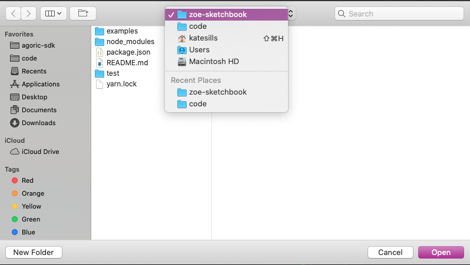
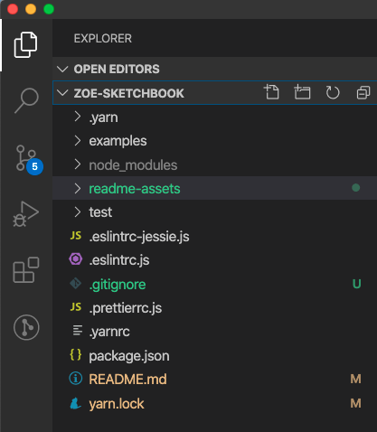

# Zoe Sketchbook

An easy way to get started building JavaScript smart contracts on Zoe.
Draft and lightly test your smart contact code here.

## Getting started

The following instructions are written for MacOS. If they don't work for you, or you can contribute instructions for a different platform, please
create a [new Github
issue](https://github.com/Agoric/zoe-sketchbook/issues/new) describing
the problem.

### Prerequisites and Recommendations

#### Required
1. XCode Command Line Tools - you likely will prompted to install this
   in the [terminal](https://blog.teamtreehouse.com/introduction-to-the-mac-os-x-command-line) as you install the following items.
2. [Node.js 12.16.2 LTS](https://nodejs.org/) - this is the JavaScript engine that
   will run the code
3. [Homebrew](https://brew.sh/) - we will use this in the next step to install `yarn`
4. [Yarn 1](https://classic.yarnpkg.com/) - install using Homebrew in
   the [terminal](https://blog.teamtreehouse.com/introduction-to-the-mac-os-x-command-line) by typing `brew install yarn` and hitting Enter.

#### Recommendations

We recommend using
[`nvm`](https://github.com/nvm-sh/nvm#install--update-script) to
switch between Node versions as necessary.

We also recommend using [Visual Studio Code](https://code.visualstudio.com/) as
your code editor.

### Grab a local copy of Zoe Sketchbook

In the terminal, navigate to the folder in which you would like to
download Zoe Sketchbook (we recommend a `code` directory, created by entering
`mkdir code`):

```
cd code
git clone https://github.com/Agoric/zoe-sketchbook.git
cd zoe-sketchbook
yarn install
```

## Editing and inspecting the code

Open up Visual Studio Code (VS Code), and open the `zoe-sketchbook`
folder (you can find it under `Users/[your username]/code/`).



You should now see a number of files in the file explorer on the left
hand side.



## Looking at Examples

In the
[`examples/`](https://github.com/Agoric/zoe-sketchbook/tree/master/examples)
folder (you can look at this on Github.com, but we recommend viewing
the files locally using VS Code), there are examples of minting fungible tokens
(`baytownBucks.js`), and securely trading with another person using
the atomicSwap contract running on Zoe (`tradeWithAtomicSwap.js`).
Additionally, all of the contracts written by Agoric for Zoe are
copied into `zoe-contracts-copied` for your perusal. 

## Running Tests

Some of the these examples have tests that you can run and look at to see how they work, and use them as templates to create your own tests. You can find these tests in the `test` directory.

To run all of the tests, do: `yarn test` from the command
line/terminal.

We use the [`tape` testing framework](https://github.com/substack/tape). It was installed for you when you
ran `yarn install`.

### Running one test at a time

You can add `.only` to a test to run only that test:

```js
test.only('timing test', t => {
});
```

## Adding your own contracts

Feel free to make a new file in your local copy (what you just cloned)
and write out your own contract. You will probably want to create a
test file for your contract as well to make sure it works as intended. 

Happy contracting!
